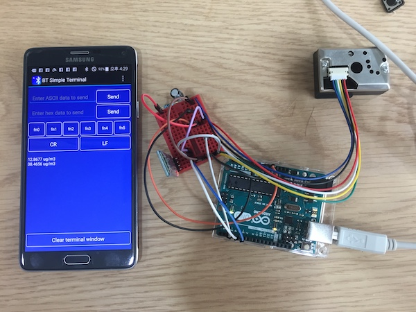

## Prototype for find dust check module

(https://www.youtube.com/watch?v=U9X9PtBNoPg)

Yellow dust became a pretty big problem in Seoul, Korea.

This prototype is designed for portable dust check module.

Made with fine dust sensor and bluetooth module and application made with Unity 3d.

It checks fine dust level in the air, and shows through appilcation in 30 secs.

